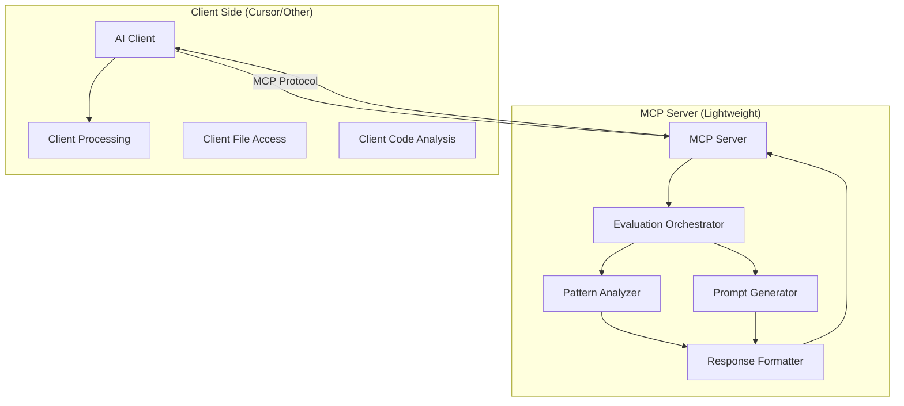

# NEAR Rubric MCP Server Architecture

## Overview

The NEAR Rubric MCP Server evaluates NEAR Protocol projects using a hybrid approach that combines pattern detection with LLM-guided analysis. The server provides structured evaluation data that AI clients can process using their own language models.

## Core Architecture



## Design Principles

1. **Client-Agnostic**: Works with any MCP client, leveraging their existing capabilities
2. **Evaluation Logic Only**: Server provides evaluation criteria and prompts, not file access
3. **Lightweight Server**: Minimal processing, delegates file operations to clients
4. **Structured Guidance**: Returns evaluation frameworks for client-side processing
5. **Tool-Aware**: Adapts response based on client capabilities

## Component Specifications

### 1. MCP Server Interface

**Purpose**: Provide NEAR rubric evaluation tools to MCP clients

**Key Functions**:
- Register evaluation tools with clear input/output contracts
- Return evaluation frameworks and prompts
- Guide clients on what code/files to analyze

**Tools to Expose**:
```json
{
  "tools": [
    {
      "name": "get_evaluation_framework",
      "description": "Get evaluation framework for a specific rubric category",
      "parameters": {
        "category": "string (near_integration|onchain_quality|...)",
        "project_type": "string (optional: rust|javascript|mixed)"
      }
    },
    {
      "name": "analyze_code_context",
      "description": "Analyze provided code context against rubric",
      "parameters": {
        "category": "string",
        "code_context": "object (client-provided code snippets)",
        "metadata": "object (optional: file paths, dependencies)"
      }
    },
    {
      "name": "get_file_suggestions",
      "description": "Get suggestions for which files to analyze",
      "parameters": {
        "category": "string",
        "available_files": "array (file paths in repository)"
      }
    }
  ]
}
```

### 2. Evaluation Orchestrator

**Purpose**: Coordinate evaluation logic without direct file access

**Responsibilities**:
- Generate evaluation prompts based on category
- Provide structured scoring criteria
- Guide clients on what code to analyze
- Return evaluation frameworks, not direct scores

**Output Example**:
```json
{
  "category": "near_integration",
  "evaluation_framework": {
    "analysis_prompt": "Analyze the provided code for NEAR Protocol integration...",
    "scoring_criteria": {
      "16-20": "Deep integration with advanced features",
      "10-15": "Moderate integration",
      "0-9": "Minimal integration"
    },
    "key_indicators": [
      "NEAR SDK usage",
      "Smart contract implementation",
      "Wallet integration",
      "Cross-contract calls"
    ],
    "suggested_files": [
      "**/*contract*.rs",
      "**/Cargo.toml",
      "**/*near*.js",
      "**/package.json"
    ]
  }
}
```

### 3. Pattern Analyzer

**Purpose**: Provide pattern-based evaluation guidance

**Functionality**:
- Return regex patterns and indicators for quick checks
- Suggest confidence levels based on pattern matches
- Help clients identify obvious characteristics

**Note**: This component returns patterns for the client to use, not the results of pattern matching.

### 4. Prompt Generator

**Purpose**: Create contextual evaluation prompts

**Responsibilities**:
- Generate category-specific prompts
- Adapt prompts based on project type
- Include scoring rubrics in prompts
- Provide structured output formats

**Example Output**:
```json
{
  "prompt": "Analyze this Rust smart contract for NEAR Protocol integration...",
  "context_requirements": {
    "must_include": ["contract definition", "public methods"],
    "nice_to_have": ["test files", "integration code"],
    "max_tokens": 4000
  },
  "output_format": {
    "score": "integer 0-20",
    "justification": "string",
    "findings": "object"
  }
}
```

### 5. Response Formatter

**Purpose**: Structure guidance for client consumption

**Output Types**:
1. **Evaluation Framework**: Complete rubric and prompts for client-side evaluation
2. **File Suggestions**: Guidance on which files to analyze
3. **Pattern Library**: Regex patterns for quick detection
4. **Scoring Guide**: Detailed scoring criteria and examples

## Evaluation Strategies by Category

### NEAR Integration (Hybrid)
- **Quick Detection**: SDK presence, contract markers
- **LLM Analysis**: Integration depth, feature utilization
- **Context Focus**: Contracts, configuration, wallet code

### Onchain Quality (LLM-Guided)
- **Quick Detection**: Transaction patterns
- **LLM Analysis**: Transaction meaningfulness, state management
- **Context Focus**: Contract methods, transaction handlers

### Code Quality (Hybrid)
- **Quick Detection**: Test presence, documentation files
- **LLM Analysis**: Code structure, maintainability
- **Context Focus**: Source files, tests, documentation

### Technical Innovation (LLM-Guided)
- **Quick Detection**: Unique file patterns
- **LLM Analysis**: Novel approaches, architectural decisions
- **Context Focus**: Core implementation files, architecture docs

### Team Activity (Pattern-Based)
- **Quick Detection**: File timestamps, TODOs, version markers
- **LLM Analysis**: Not required
- **Context Focus**: Metadata, documentation

## Implementation Guidelines

### File Structure
```
near-rubric-mcp/
├── server.py              # MCP server setup
├── evaluation/
│   ├── orchestrator.py    # Evaluation framework coordinator
│   ├── prompt_generator.py # Dynamic prompt generation
│   └── pattern_library.py # Pattern definitions
├── categories/
│   ├── base.py           # Base category class
│   ├── near_integration.py
│   ├── onchain_quality.py
│   └── [other categories]
├── config/
│   ├── rubric.yaml       # Rubric specifications
│   └── patterns.yaml     # Pattern library
└── resources/
    └── prompts/          # Prompt templates
```

### Configuration Example
```yaml
# config/rubric.yaml
categories:
  near_integration:
    max_points: 20
    evaluation_type: "hybrid"
    key_indicators:
      - "NEAR SDK presence"
      - "Smart contract implementation"
      - "Wallet integration"
      - "NEP standards compliance"
    file_patterns:
      - "**/*contract*.rs"
      - "**/Cargo.toml"
      - "**/*near*.{js,ts}"
    scoring_tiers:
      advanced: 
        range: [16, 20]
        criteria: "Deep integration with advanced features"
      moderate:
        range: [10, 15]
        criteria: "Basic integration with standard features"
      minimal:
        range: [0, 9]
        criteria: "Limited or no NEAR integration"
```

## Client Integration (Cursor/Other Tools)

The MCP server provides evaluation frameworks and lets clients handle file access and code analysis using their native capabilities.

### Cursor-Specific Workflow

1. **Cursor User Request**: "Score this repo per the NEAR rubric"
2. **Cursor Calls MCP Tool**: `get_evaluation_framework` for each category
3. **Cursor Uses Native Features**:
   - File indexing and search
   - Code context extraction
   - LLM processing with extracted code
4. **Cursor Applies Evaluation**: Uses MCP-provided prompts and criteria
5. **Cursor Presents Results**: Formatted scores and justifications

### Generic Client Workflow

1. **Request Evaluation Framework**:
   ```
   Tool: get_evaluation_framework
   Input: { "category": "near_integration" }
   ```

2. **Receive Framework**:
   - Evaluation prompts
   - Scoring criteria  
   - Suggested file patterns
   - Key indicators

3. **Client Extracts Code**:
   - Uses suggested file patterns
   - Applies its own file access methods
   - Builds code context

4. **Client Processes with LLM**:
   - Uses provided prompts
   - Analyzes extracted code
   - Generates scores and justifications

5. **Client Formats Results**:
   - Aggregates category scores
   - Creates final report

### Benefits of This Approach

- **No Duplicate File Access**: Leverages client's existing capabilities
- **Tool Agnostic**: Works with any MCP-compatible client
- **Flexible Integration**: Clients can use their preferred methods
- **Focused Responsibility**: Server provides evaluation logic only
- **Efficient**: Minimizes redundant operations

## Performance Considerations

1. **Stateless Server**: Each request is independent, no caching needed
2. **Lightweight Responses**: Return evaluation frameworks, not file contents
3. **Client-Side Optimization**: Leverage client's file indexing and caching
4. **Minimal Processing**: Server only generates prompts and criteria

## Error Handling

1. **Repository Access**: Validate paths, handle missing files
2. **Pattern Matching**: Graceful handling of regex errors
3. **Context Building**: File size limits, encoding issues
4. **Response Formatting**: Ensure valid JSON structure

## Security Measures

1. **Path Validation**: Prevent directory traversal
2. **File Size Limits**: Prevent memory exhaustion
3. **Content Sanitization**: Remove sensitive information
4. **Timeout Controls**: Limit processing duration

## Future Enhancements

1. **Custom Rubrics**: User-defined evaluation criteria
2. **Incremental Analysis**: Process only changed files
3. **Result Caching**: Store analysis for unchanged repos
4. **Pattern Learning**: Update patterns based on usage
5. **Multi-Language Support**: Extend beyond Rust/JavaScript

## Development Workflow

1. **Start with MCP Server**: Basic tool registration and response structure
2. **Implement Evaluation Frameworks**: One category at a time
3. **Create Prompt Templates**: Dynamic prompts for each category
4. **Define Pattern Library**: Simple indicators, not comprehensive rules
5. **Test with Cursor**: Ensure seamless integration
6. **Validate with Other Clients**: Test with non-Cursor MCP clients

## Key Implementation Notes

### For AI Developers

1. **Focus on Evaluation Logic**: The server provides evaluation frameworks, not file access
2. **Return Structured Guidance**: Prompts, patterns, and scoring criteria
3. **Keep It Stateless**: Each request should be independent
4. **Leverage Client Capabilities**: Don't duplicate what clients already do well

### Tool Response Example

When a client calls `get_evaluation_framework("near_integration")`, return:

```json
{
  "category": "near_integration",
  "max_points": 20,
  "evaluation_prompt": "Analyze this code for NEAR Protocol integration:\n\n1. SDK Usage: Look for near-sdk-rs, near-sdk-js, or near-api-js\n2. Smart Contracts: Identify #[near_bindgen] or @NearBindgen decorators\n3. Wallet Integration: Find wallet connection implementations\n4. NEAR Standards: Check for NEP implementations\n\nScore 0-20 based on depth and sophistication of integration.",
  "scoring_guide": {
    "16-20": "Deep integration with advanced features like cross-contract calls",
    "10-15": "Standard integration with basic contract and wallet features",
    "0-9": "Minimal or no NEAR integration"
  },
  "suggested_files": [
    "**/Cargo.toml",
    "**/package.json",
    "**/*contract*.rs",
    "**/*near*.{js,ts}",
    "**/src/lib.rs"
  ],
  "quick_check_patterns": [
    "near-sdk-rs",
    "near-sdk-js",
    "#\\[near_bindgen\\]",
    "WalletConnection"
  ]
}
```

## Benefits of This Architecture

1. **Avoids Redundancy**: Doesn't duplicate Cursor's file access capabilities
2. **Tool Agnostic**: Works with any MCP client that can read files
3. **Focused Purpose**: Provides NEAR evaluation expertise only
4. **Maintainable**: Evaluation logic centralized in one place
5. **Flexible**: Clients can implement their own optimization strategies

This lightweight architecture leverages the strengths of MCP clients while providing specialized NEAR evaluation capabilities.

